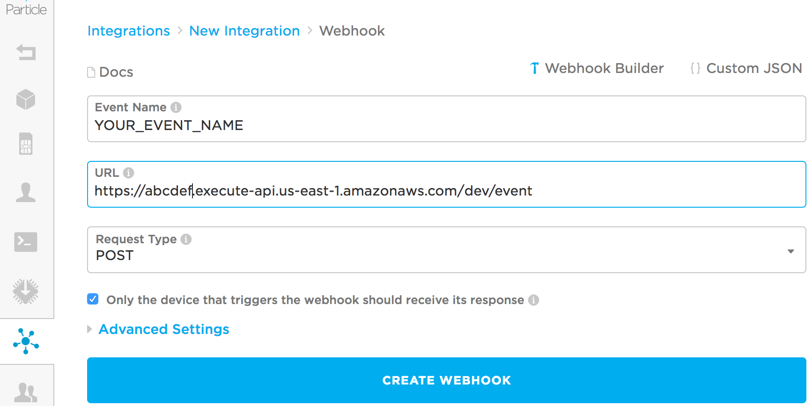

This is a quick example of how to set up an AWS Lambda to save data from you particle events in DynamoDB.

We'll be using [Node.js](https://nodejs.org) and [Serverless](https://serverless.com/)


## 1. Install

```sh
# Install Serverless
npm install serverless -g

# Install packages
npm install
```


## 2. Set AWS credentials

```sh
export AWS_ACCESS_KEY_ID="Your AWS Access Key ID"
export AWS_SECRET_ACCESS_KEY="Your AWS Secret Access Key"
export AWS_REGION="us-east-1"
```


## 3. Create particle-event table

We're using [Dynamoose](https://dynamoosejs.com/) to simplify our DynamoDB setup.

```sh
node Event.js
```

## 4. Deploy Lambda and API GW

Use serverless to deploy to your AWS account.  Copy the URL returned by serverless for use in the webhook.

```sh
serverless deploy
```

## 5. Setup your webhook in particle



## 6. Done

It should be working now. You'll probably want to add some API keys for security too.
